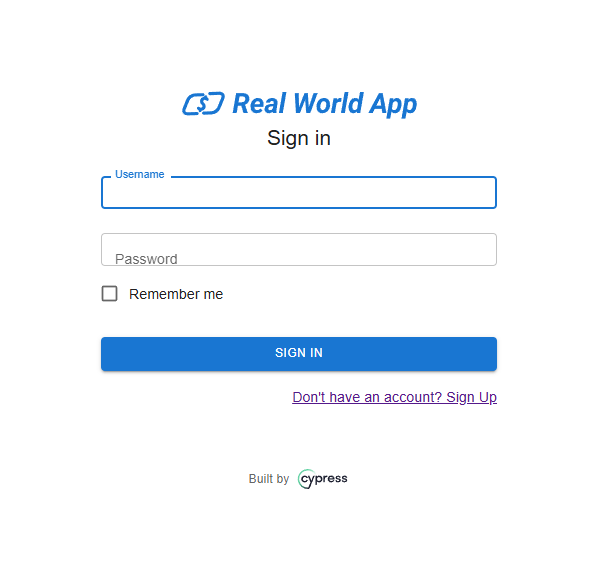

# 🚀 Getting Started with Cypress

[](https://github.com/PedroAraujoBOliveira/cypress-first-steps)
[](https://github.com/PedroAraujoBOliveira/cypress-first-steps)
[](https://www.linkedin.com/in/pedroaraujoboliveira/)
[](./LICENSE)

This repository documents my **first experience using Cypress** — a powerful JavaScript-based framework for end-to-end testing.  
The studies were conducted using the frontend of the **Real World App**, a demo application designed to simulate real user behavior and system complexity.



---

## 🛠 Technologies Used

- `JavaScript`
- `Cypress`
- `Node.js`
- `Visual Studio Code`

---

## 📚 Summary of Commands

Here is a step-by-step summary to get started with Cypress:

1. **Make sure Node.js and npm are installed:**
   ```bash
   node -v
   npm -v
   ```
   If not installed, visit [Node.js](https://nodejs.org/) to download.

2. **Initialize your Node project:**
   ```bash
   npm init -y
   ```

3. **Install Cypress as a dev dependency:**
   ```bash
   npm install cypress --save-dev
   ```
   > 💡 Always try to use the latest versions of Node, npm, and Cypress.

4. **Verify the installation:**
   ```bash
   npx cypress -v
   ```

5. **Launch Cypress:**
   ```bash
   npx cypress open
   ```

---

## 📁 Project Structure

- The **`e2e`** folder is the default location for your Cypress test files.
- Cypress recognizes test files that end in **`.cy.js`** by default.

---

## ▶️ How to Use

1. **Clone the repository:**
   ```bash
   git clone https://github.com/PedroAraujoBOliveira/cypress-first-steps.git
   ```

2. **Navigate into the project folder:**
   ```bash
   cd cypress
   ```

3. **Install dependencies:**
   ```bash
   npm install
   ```

4. **Open Cypress UI:**
   ```bash
   npx cypress open
   ```
   This will launch the test runner interface.

5. **Run tests directly in the Cypress UI** or through terminal using:
   ```bash
   npx cypress run
   ```

> 🧠 Tip: Use Visual Studio Code for a better developer experience.

---

## 📌 Goal

Explore and practice Cypress basics to gain confidence in writing and executing end-to-end automated tests.

---

## 📈 Next Steps

- Automate user flows in the Real World App
- Explore intercepts and mock API requests
- Write assertions and validations
- Integrate with CI/CD pipeline

---

## 💡 Inspiration

This project was created to solidify my first steps in **test automation using Cypress**.  
It marks the beginning of my journey into more advanced QA practices and tools.

---

## 📨 Contact

Feel free to connect or follow my progress:

- [LinkedIn](https://www.linkedin.com/in/pedroaraujoboliveira/)
- [GitHub](https://github.com/PedroAraujoBOliveira)